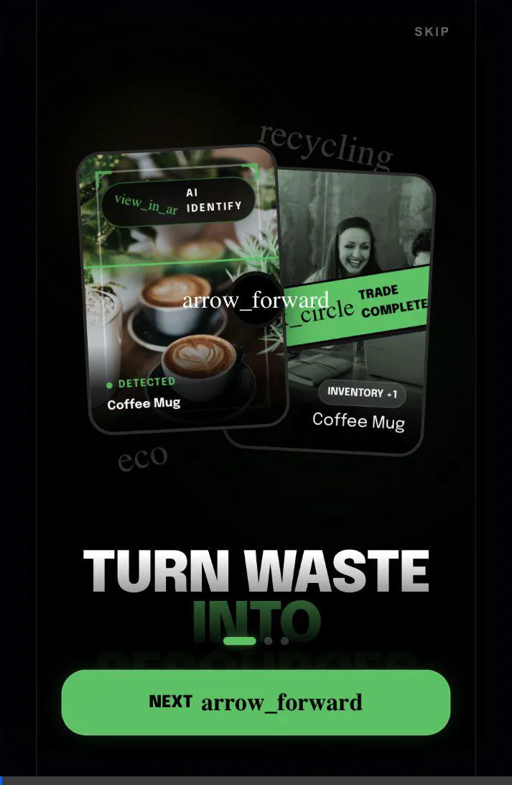
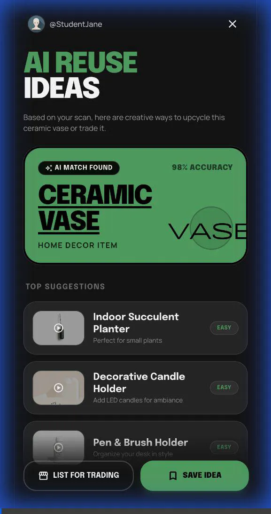

# 🌿 ReLoop - Campus Sustainability Trading App

> A mobile-first web app where college students trade, swap, and recycle items to earn eco-coins and reduce campus waste.

   

---

## 🎬 Demo

### Onboarding Flow
<p align="center">
  
</p>

*Navigate through the beautiful onboarding experience - from welcome slides to the home dashboard.*

### AI Scanning & Recommendations
<p align="center">
  
</p>

*Scan items with AI to get upcycling ideas, recycling info, and trade recommendations.*

---

## 📱 Screenshots

<p align="center">
  
  
  
</p>


---

## 🚀 Quick Start

```bash
# Clone the repo
git clone https://github.com/Ankush-Jha/unscraped.git
cd unscraped

# Serve locally (pick one)
npx serve -p 3000        # Using npx
python -m http.server 3000   # Using Python
open index.html          # Or just open in browser

# Visit
http://localhost:3000
```

---

## 🛠️ Tech Stack

| Layer | Tech |
|-------|------|
| **Frontend** | HTML5, CSS3 (vanilla), JavaScript ES6 |
| **Styling** | Custom CSS with CSS variables, Tailwind (wrapped.html) |
| **Icons** | Material Symbols Outlined |
| **Fonts** | Space Grotesk, Manrope, Bebas Neue |
| **Hosting** | Static files (GitHub Pages compatible) |

---

## 📁 Project Structure

```
reloop/
├── index.html                      # Entry point (redirects to onboarding)
│
├── 📁 pages/
│   ├── 🏠 core/                    # Main pages
│   │   ├── home.html               # Dashboard
│   │   ├── onboarding.html         # Welcome flow
│   │   └── search.html             # Search
│   │
│   ├── 🛒 marketplace/             # Trading
│   │   ├── marketplace.html        # Browse items
│   │   ├── item.html               # Item template
│   │   ├── item-*.html             # Specific items
│   │   ├── trade.html              # Trade confirmation
│   │   └── create-listing.html     # List new item
│   │
│   ├── 🔍 scanner/                 # AI features
│   │   ├── scanning.html           # AI analysis animation
│   │   ├── scan1.html              # Scan results summary
│   │   ├── scan2.html              # Detailed ideas
│   │   ├── result.html             # Static result
│   │   ├── recycle.html            # Recycling info
│   │   └── upcycle.html            # Upcycling guide
│   │
│   ├── 🏆 gamification/            # Game features
│   │   ├── missions.html           # Daily missions
│   │   ├── achievements.html       # Badges
│   │   ├── leaderboard.html        # Campus rankings
│   │   ├── level-up.html           # Level celebration
│   │   └── wrapped.html            # Eco Wrapped stats
│   │
│   ├── 👤 user/                    # User pages
│   │   ├── profile.html            # User profile
│   │   ├── settings.html           # App settings
│   │   ├── notifications.html      # Notifications
│   │   ├── messages.html           # Chat list
│   │   └── chat.html               # Chat view
│   │
│   ├── 📖 stories/                 # Success stories
│   │   ├── success-stories.html    # All stories
│   │   └── story-*.html            # Individual stories
│   │
│   └── 🪙 rewards/
│       └── redeem.html             # Coin redemption
│
├── 📁 css/
│   └── styles.css                  # Global styles
│
├── 📁 js/
│   └── app.js                      # Main JavaScript
│
├── 📁 images/                      # All images
│
└── README.md
```

---

## ✨ Features

- **🔍 AI Item Scanner** - Scan items to get upcycle ideas and coin estimates
- **🛒 Marketplace** - Browse and trade items with other students
- **🪙 Eco Coins** - Earn coins for trades, redeem for campus rewards
- **🏆 Gamification** - Daily missions, achievements, campus leaderboard
- **📊 Eco Wrapped** - Your sustainability stats, Spotify-Wrapped style

---

## 👨‍💻 Built By

**Ankush Jha**  
GitHub: [@Ankush-Jha](https://github.com/Ankush-Jha)

---

## 📄 License

MIT License - feel free to fork and build upon this!
